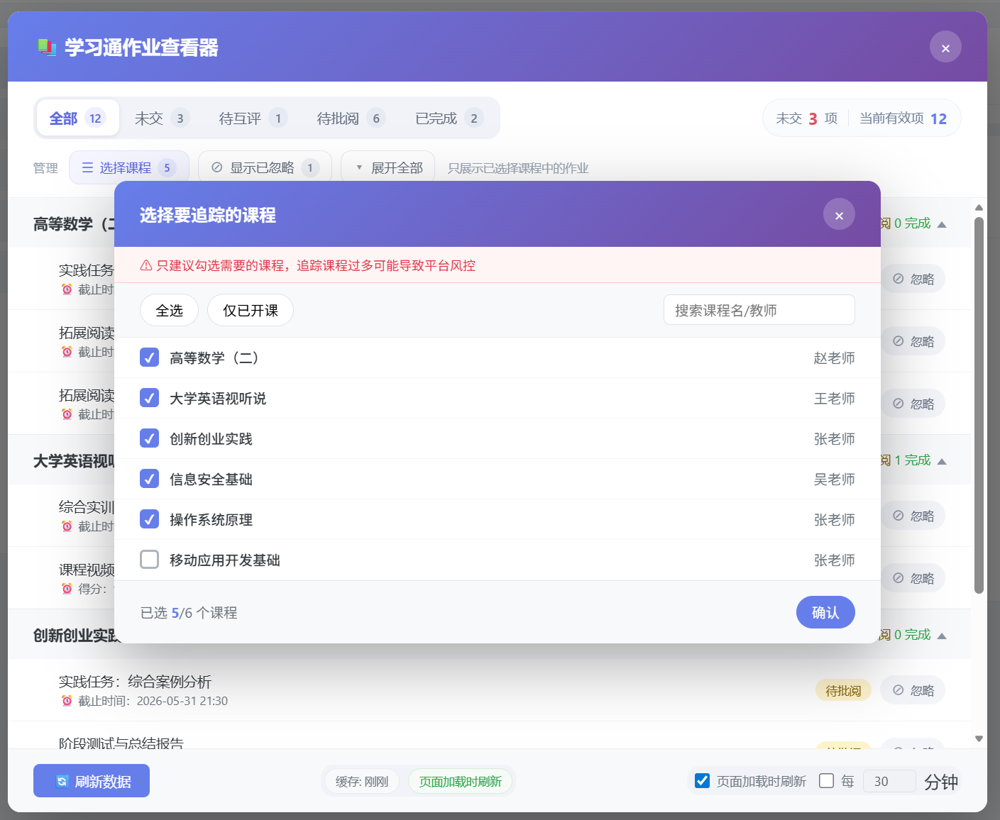
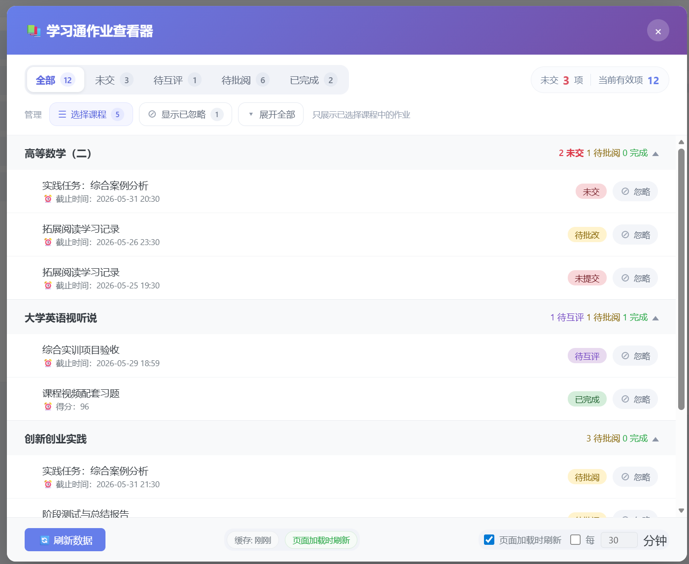

# 学习通作业统一查看器

篡改猴(Tampermonkey)用户脚本，一键检测学习通所有课程作业状态，统一展示在悬浮面板中。




**当前版本**: 2.1.0

## 功能特性

- 自动获取当前账号所有课程的作业数据
- 课程选择功能：首次加载弹出选择面板，支持搜索、全选/全不选/仅已开课，可随时通过工具栏「选择课程」按钮修改，选择状态跨会话持久化（建议不超过 12 门以避免风控）
- 按课程分组显示，支持展开/折叠（展开状态跨渲染保持）
- 状态标签：未交（红）、待互评（紫）、待批阅（黄）、已完成（绿）、其他（灰）
  - 已互评归入已完成分类
- 分段筛选标签页：全部 / 未交 / 待互评 / 待批阅 / 已完成（状态跨会话持久化，各标签显示实时数量）
- 摘要栏：显示未交总数和当前有效项数
- 忽略作业：鼠标悬停显示「忽略」按钮，隐藏后不计入待办；可通过「显示已忽略」按钮切换显示，支持「恢复」
- 「隐藏已结课」按钮，过滤已过期课程并跳过其作业请求
- 课程名称点击跳转课程作业列表页，作业条目点击跳转作业详情页
- 两层缓存架构：课程列表全量缓存 + 作业数据按课程独立缓存（各30分钟TTL）
- 加载提示明确显示跳过原因（已结课 / 已缓存）
- 并发控制（3路），课程间并行、同一课程内分页请求间隔 500ms，避免触发平台限流
- 自动刷新：支持「页面加载时刷新」（默认开启）和「定时刷新」（可设 1-120 分钟间隔），两种模式可同时启用
  - 页面加载刷新使用 sessionStorage + Navigation API 智能判断：F5 刷新和外部入口触发，从插件打开新标签页时跳过
  - 缓存只在首次使用和手动刷新时更新，站内导航不会触发额外请求
- 请求超时15秒，失败自动重试2次
- 仅在顶层窗口注入UI，iframe内不显示
- ESC键关闭面板
- 安全防护：safeUrl 协议校验、escText/escAttr 上下文转义、ID纯数字校验

## 安装

1. 安装 [Tampermonkey](https://www.tampermonkey.net/) 浏览器扩展
2. 点击 Tampermonkey 图标 → 创建新脚本
3. 清空编辑器内容，粘贴 `chaoxing-homework-checker.user.js` 全部内容
4. `Ctrl+S` 保存
5. 访问任意 `chaoxing.com` 页面，右下角出现按钮即安装成功

## 使用

- 点击右下角浮动按钮打开作业面板
- 首次打开会弹出课程选择面板，勾选需要追踪的课程（建议不超过 12 门以避免风控）
- 点击「选择课程」按钮可随时修改追踪的课程列表
- 点击课程名称展开该课程的作业列表
- 使用顶部分段筛选标签页切换显示状态（各标签旁显示实时数量）
- 摘要栏显示未交作业总数和当前有效项数
- 鼠标悬停作业条目，点击「忽略」按钮可隐藏该作业（不计入待办）；点击「显示已忽略」可查看并恢复
- 点击「隐藏已结课」过滤已过期课程（状态跨会话保存，刷新时跳过请求）
- 点击「展开全部/折叠全部」批量切换所有课程（展开状态跨渲染保持）
- 按 `Escape` 键关闭面板
- 点击「刷新数据」清除全部缓存重新加载
- 底部提供自动刷新控制：勾选「页面加载时刷新」在 F5 时自动获取最新数据；勾选定时刷新可设置间隔分钟数

## API 结构

开发过程中通过浏览器 CDP 协议逆向分析得出：

| 步骤 | 端点 | 说明 |
|------|------|------|
| 课程列表 | `mooc1-api.chaoxing.com/mycourse/backclazzdata` | JSON 接口，返回所有已加入课程 |
| 获取 workEnc | `mooc1.chaoxing.com/visit/stucoursemiddle` | 重定向到课程页，解析 `<input id="workEnc">` |
| 作业列表 | `mooc1.chaoxing.com/mooc-ans/mooc2/work/list` | HTML 页面，需 `enc` 参数 |

关键参数：
- `courseId` — 课程 ID（纯数字）
- `classId` — 班级 ID（纯数字）
- `cpi` — 课程人员 ID（纯数字）
- `workEnc` — 每课程加密令牌，从课程页 HTML 中提取

## 技术栈

- Tampermonkey 用户脚本
- `GM_xmlhttpRequest` 绕过跨域限制（含超时和重试）
- `GM_setValue` / `GM_getValue` 两层缓存（课程列表 + 作业数据）
- `GM_addStyle` 样式注入
- DOMParser 解析 HTML 响应
- sessionStorage + Navigation API 智能刷新检测
- 原生 CSS，无外部依赖

## ⚠ 风控声明

本脚本通过自动化请求获取课程作业数据，**可能触发学习通平台的风控机制**。触发风控后可能出现以下情况：

- 需要手动输入验证码才能继续使用学习通
- 部分功能暂时受限
- 极端情况下可能导致账号异常

**介意者请勿使用。** 使用本脚本所产生的一切后果由使用者自行承担。

降低风控风险的建议：
- 使用课程选择功能，追踪课程不超过 12 门
- 避免短时间内频繁手动刷新
- 开启「隐藏已结课」减少无效请求

## 限制

- 仅支持学生账号（`roletype: 3`）
- 作业状态依赖平台 HTML 结构，平台更新可能导致解析失效
- 已结课课程的判断基于 `isretire` 字段和 `endDate`，可能有误判
- 平台使用繁简混合中文状态文本，使用正则模糊匹配

## 许可证

本项目基于 [GNU General Public License v3.0](LICENSE.txt) 开源。

## 文件结构

```
chaoxing-homework-checker/
├── chaoxing-homework-checker.user.js   # 篡改猴脚本主文件
├── greasyfork-description.md           # Greasy Fork 发行说明
├── LICENSE.txt                         # GPL-3.0 许可证
└── README.md
```

## 开发历程

开发工具：Claude Code + Codex (GPT-5.5) 协作

1. 通过 CDP Proxy 连接用户 Chrome，获取学习通登录态
2. 探索课程列表 API（JSON 接口，直接可用）
3. 尝试作业列表 JSON API → 返回 403，不可用
4. 通过 Codex 探索发现 workEnc 机制：需先从课程页提取加密令牌
5. 确认作业列表为 HTML 接口，解析 `<li>` 元素获取作业数据
6. 生成完整用户脚本
7. 经过 5 轮 Codex 审查，累计修复 55+ 个问题（XSS、竞态、类型安全、缓存架构等）
8. 重构为两层缓存架构，hideFinished 真正跳过已结课课程请求
9. 添加课程选择功能，减少请求量以避免风控
10. 添加待互评/已互评状态支持，繁简体适配
11. 添加自动刷新（页面加载 + 定时），使用 sessionStorage + Navigation API 智能判断
12. v2.0.2：UI 重构（分段筛选标签页、摘要栏、工具按钮、展开状态持久化、忽略按钮重设计）
13. v2.1.0：修复搜索输入 IME 问题、showIgnored 过滤逻辑 bug、箭头方向调整、代码去重
